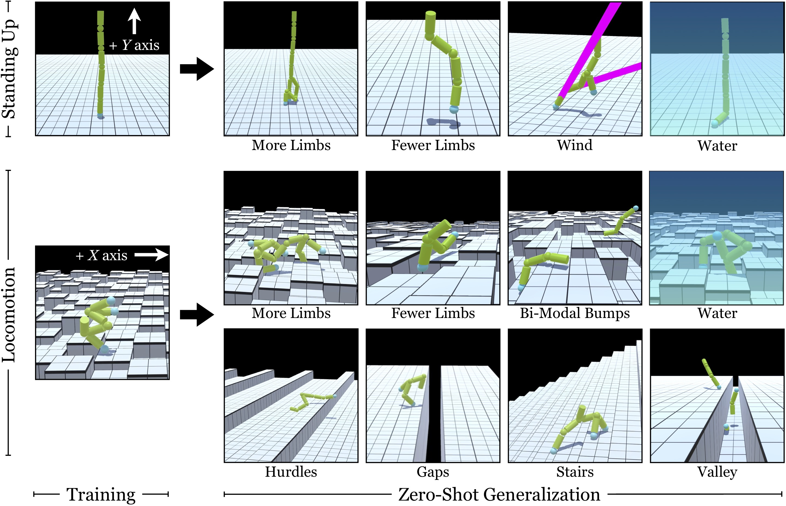

## Learning to Control Self-Assembling Morphologies ##
### Winner of [Virtual Creatures Competition at GECCO 2019, Prague](https://virtualcreatures.github.io/)
#### [[Project Website]](https://pathak22.github.io/modular-assemblies/) [[Demo Video]](https://youtu.be/ngCIB-IWD8E)

[Deepak Pathak](https://people.eecs.berkeley.edu/~pathak/)&ast;, [Chris Lu](https://chris-lu.weebly.com/)&ast;, [Trevor Darrell](https://people.eecs.berkeley.edu/~trevor/), [Phillip Isola](https://www.eecs.mit.edu/people/faculty/phillip-isola/), [Alexei A. Efros](https://people.eecs.berkeley.edu/~efros/)<br/>
University of California, Berkeley<br/>
MIT

<a href="envs/teaser.jpg">

</img></a>

This is a pytorch based implementation for our [paper on learning to control self-assembling agents using deep reinforcement learning](https://pathak22.github.io/modular-assemblies/). We investigate a modular co-evolution strategy: a collection of primitive agents learns to dynamically self-assemble into composite bodies while also learning to coordinate their behavior to control these bodies. We learn compositional policies to demonstrate better zero-shot generalization. If you find this work useful in your research, please cite:

    @inproceedings{pathak19assemblies,
        Author = {Pathak, Deepak and Lu, Chris and Darrell, Trevor and
                  Isola, Phillip and Efros, Alexei A.},
        Title = {Learning to Control Self-Assembling Morphologies:
                  A Study of Generalization via Modularity},
        Booktitle = {arXiv preprint arXiv:1902.05546},
        Year = {2019}
    }

### Installation and Usage

1. Setting up repository
  ```Shell
  git clone https://github.com/pathak22/modular-assemblies.git
  cd modular-assemblies/
  git clone https://github.com/Unity-Technologies/ml-agents.git
  cd ml-agents/
  git reset --hard 6c5255e
  cd ..
  bash envs/setup_env.sh

  python3 -m venv assemblyEnv
  source $PWD/assemblyEnv/bin/activate
  pip install --upgrade pip
  ```

2. Installation
    - Requirements:
      - CUDNN-5.1, CUDA-8.0, Python-3.5
    - Detailed setup, skip to quick setup for exact replication:
    ```Shell
    # Install Pytorch from http://pytorch.org/
    pip install http://download.pytorch.org/whl/cu80/torch-0.3.0.post4-cp35-cp35m-linux_x86_64.whl
    pip install torchvision
    pip install --upgrade visdom

    # Install baselines for Atari preprocessing
    pip install gym==0.9.4 # baselines install latest gym first automatically, but latest gym has moved to mujoco5 so first install old gym and then install baselines
    git clone https://github.com/openai/baselines.git
    cd baselines
    git reset --hard b5be53d
    pip install -e .

    # Additional packages
    pip install numpy
    pip install matplotlib
    pip install pillow
    pip install opencv-python

    # fold
    cd modular-assemblies/src/
    git clone https://github.com/nearai/pytorch-tools.git
    cd pytorch-tools/
    git reset --hard 09dccb2
    python setup.py install
    ```
    - Quick setup for exact replication:
    ```Shell
    pip install -r requirements.txt
    ```

3. Run code
  ```Shell
  cd modular-assemblies/src/
  python test_env.py
  ```

### Acknowledgement
Builds upon Ilya Kostrikov's Pytorch PPO [implementation](https://github.com/ikostrikov/pytorch-a2c-ppo-acktr).
